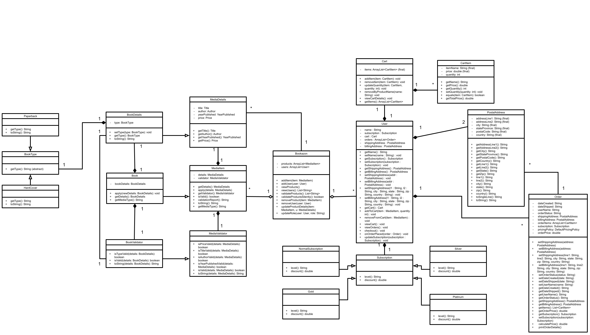

# Group Sprint 1: Bookazon


```

███████╗██████╗ ██████╗ ██████╗ ██╗   ██╗ ██████████╗
██╔════╝██╔══██╗██╔══██╗  ██╗║  ████╗ ██║╚══ ██╔══╝
███████╗██████╔╝██████╔╝  ██╔╝  ██║██╔██╗    ██║
╚════██║██╔══██╗██╔═██═╝  ██═══╝██║ ████╚╗   ██
███████║██║  ██║██║ ██║ ██████║ ██    ██║    ██║      
╚══════╝╚═╝  ╚═╝╚═╝ ╚═╝ ╚═╝╚═╝ ╚═══╝ ╚═╝
                                ██
                               ███
                                ██
                                ██
                                ██
                                ██
                              ██████

```


An assignment for redesigning software and refactoring code smells. Part of Software Engineering class CS321, fall 2025.

---

## Project Objectives
- Practice redesigning a software project with guidance from **SOLID design principles**.
- Refactor code to address **design smells** and enhance **readability** and **maintainability**.
- Apply **Agile Scrum** and **project management** fundamentals.
- Collaborate as a team using **Git** and **GitHub** effectively.

---

## Overview
We took a small online bookstore and turned it into a cleaner, extensible system. The headline features this sprint:
- **Order printouts show discount details** (tier, % off, amount, final total).
- **Catalog supports more than books**: Audiobooks, DVDs, and E-books under a common `MediaItem`.
- Responsibilities were separated so **domain code doesn’t print** and **validation doesn’t leak**.

### Example Output from the Terminal (console)
=== Order Summary ===
Items: 3
Subtotal: $47.97
Discount (gold 15%): -$7.20
Total: $40.77

---
```
 /\_/\  
( o.o )   "$40.77 dollars!!??"
 > ^ <      - financially struggling cat
```

## Repository Management
- Forked the starter repo and added all collaborators.
- Worked in **feature branches** for each issue (ex. `feat/discount-print`, `refactor/bookazon-view`).
- Every change merged via **PR + review**; main/development stayed green.

---

## Class Diagram and Code Review



<sub>[Open full-size diagram](UML_after.png)

Link to the Google Drawing: https://docs.google.com/drawings/d/1raz7W154k8HTIfWpvqwkp4DcXrt_aSxsfeZqA4z2jBg/edit?usp=sharing

---

## SOLID Principles, Code Smells, and Technical Debt
## Design Problems & Code Smells (Postcards)
```
  __
o'')}____//    "what is that smell... smells like code... code smells."
 `_/      )      — golden retriever of refactors
 (_(_/-(_/
```

| Area | Smell / Problem | Where / Example | Our Fix / Suggested Fix | Principle |
|---|---|---|---|---|
| **Bookazon** | **Doing too much** (SRP) | Stores collections, manages add/remove, updates details, prints, owns `main`.<br>`viewBooks()`, `viewUsers()`, `updateBookDetails(...)`, `updateRole(...)`, `main(...)` | Return data from `view*()`; move printing to a printer class; delegate updates to the domain (`MediaItem.apply`, `User.updateSubscription`); keep `main` minimal. | SRP |
| **Bookazon** | **OCP violation** | `updateBookDetails(Book, String newTitle, String newAuthor, int newYearPublished, double newPrice, boolean isPaperback)` must change whenever attributes change. | Replace parameter list with a single **details object** (e.g., `MediaDetails` / `BookDetails`) or a builder; `Bookazon` calls `item.apply(details)`. | OCP |
| **Bookazon** | **Feature Envy** | `book.setTitle(...)`, `book.setAuthor(...)`, … `user.setSubscription(role)` done from `Bookazon`. | Push behavior into the objects: `item.apply(details)`, `user.updateSubscription(role)`. | Encapsulation / Tell-Don’t-Ask |
| **Bookazon** | **Data Clump** | Repeated parameter bundle for updates: `newTitle, newAuthor, newYearPublished, newPrice, isPaperback`. | Replace with `BookDetails` / `MediaDetails`. | SRP |
| **Book** | **Doing too much** (SRP) | Holds data, **validates** (`isPriceValid`, `isTitleValid`, …) and **prints** (`printBookDetails`). | Move validation to `BookValidator`; move rendering to a printer or `BookDetails -> toString`; keep `Book` as state + behavior only. | SRP |
| **Book** | **OCP violation (formatting)** | `printBookDetails()` prints fixed console format; changing format requires editing class. | Return a data view or accept a `Renderer`; printers (console/JSON/web) format externally. | OCP |
| **Book** | **Primitive Obsession** | `String title/author`, `int yearPublished`, `double price`, `boolean isPaperback`. | Use value objects: `Title`, `Author`, `YearPublished`, `Price`; replace boolean flag with **polymorphism** (`Paperback`, `Hardcover`) or `BookType`. | Encapsulation / Polymorphism |
| **Order** | **Doing too much** (SRP) | Stores metadata, manages addresses, items, **applies discounts**, **prints**. | Extract pricing to `PricingPolicy` + `Subscription`; move printing to `OrderPrinter`; keep `Order` as aggregate + totals. | SRP |
| **Order** | **OCP violation (discounts)** | `calculatePrice(String subscription)` with `if/else` on `"gold"`, `"silver"`, … | Replace with `Subscription.applyTo(subtotal)` or strategy map; inject `PricingPolicy`. | OCP |
| **Order** | **Primitive Obsession** | Addresses as six strings; subscription as `String`; dates as `String`. | Introduce `PostalAddress`, `Subscription` (value/strategy), and proper date/time types (`LocalDate`/`LocalDateTime`). | Encapsulation |
| **Order** | **Data Clump** | Shipping/Billing each have 6 params across methods. | Replace with `PostalAddress` object; use `setShippingAddress(PostalAddress)` / `setBillingAddress(PostalAddress)`. | SRP |
| **Order** | **Magic Numbers** | Discount rates inline. | Centralize in `Subscription` or `PricingPolicy` constants/strategies. | Clarity |
| **Order** | **DIP violation** | Depends on strings + embedded rules. | Depend on abstractions: `Subscription`, `PricingPolicy`, `OrderPrinter`. | DIP |
| **User** | **Doing too much** (SRP) | Identity, subscription, two addresses, cart ops, and checkout/order creation. | Keep identity + preferences; let `OrderService` handle checkout; keep address logic in `PostalAddress`. | SRP |
| **User** | **Primitive Obsession** | Address parts as strings; subscription as `String`. | Use `PostalAddress`; use `Subscription` object/factory. | Encapsulation |
| **User** | **Data Clumps** | `setShippingAddress(l1,l2,city,state,zip,country)` and similar for billing. | Collapse to `PostalAddress` parameter. | SRP |
| **Cross-cutting** | **Law of Demeter** | Callers doing `product.getValidator().isValid(product.getDetails())`. | Provide `MediaItem.isValid()` and `validationReport()` wrappers. | LoD |


---

## Propose Solutions and Create Issues
- Reviewed the codebase and mapped each smell to a concrete fix.
- Opened GitHub issues with:
  - A short problem statement and code references.
  - A proposed refactor (SOLID principle noted) and acceptance criteria.
- Worked one issue per branch, linked PRs back to issues, and closed them on merge.

---

## Adding New Features
- Introduced an **order printout with discount visibility** so the pricing process is explicit: items form a subtotal, the subscription tier applies a percentage reduction, and the final total is shown with a clear breakdown (tier, percent, discount amount, total).  
- Centralized **discount logic** via `Subscription.applyTo(...)` (with a pricing policy), while keeping all formatting in a dedicated printer; this separation reduces coupling and makes alternate outputs (e.g., JSON/UI) straightforward.  
- Expanded the catalog to include **Audiobook, DVD, and E-book**, modeled as concrete implementations of a common `MediaItem` abstraction; each type owns its details and validation, which preserves a stable interface for callers.  
- Maintained **design guardrails** throughout (SRP/OCP/LoD/DIP): domain objects supply data and behavior, validators enforce constraints, and presentation is handled by the printer.  
- Verified the flow end-to-end by compiling/running locally and observing the expected console summary with the **discount breakdown** alongside the new media items.

---

## Milestone and Issue Organization
- One sprint milestone with labeled issues: enhancement, refactor, design, bug.
- Each PR had a short summary + screenshot or output snippet when relevant.

---

## Teamwork and GitHub Practices
- Each team member should select **one issue** at a time to work on and may take on another only after completing the current one.
- Follow Git/GitHub practices by:
  - Creating a **feature branch** for each issue.
  - Ensuring that your branch doesn't break the system (test your changes).
  - **Opening a pull request (PR)** to merge your changes back into the main branch.
- **Code Reviews:** Each team member must review at least **one PR** from another member to ensure code quality and consistency.
- Keep the **main branch** in a working state at all times. No broken or unfinished code should be merged into the main branch.
- Ensure no **stale feature branches** remain after a milestone. Clean up unused branches.

---

## Extensions
- Burndown shown in the report document
- This creative README, which includes different title formatting, tables, documentation, and fun markdown images.

---

## Report (Google Doc)
Link to Our Sprint 1 Report: https://docs.google.com/document/d/1oPctuseiby8H2aiS5yI0XEgMlWjG56N5mEKhJFcn6oo/edit?usp=sharing
